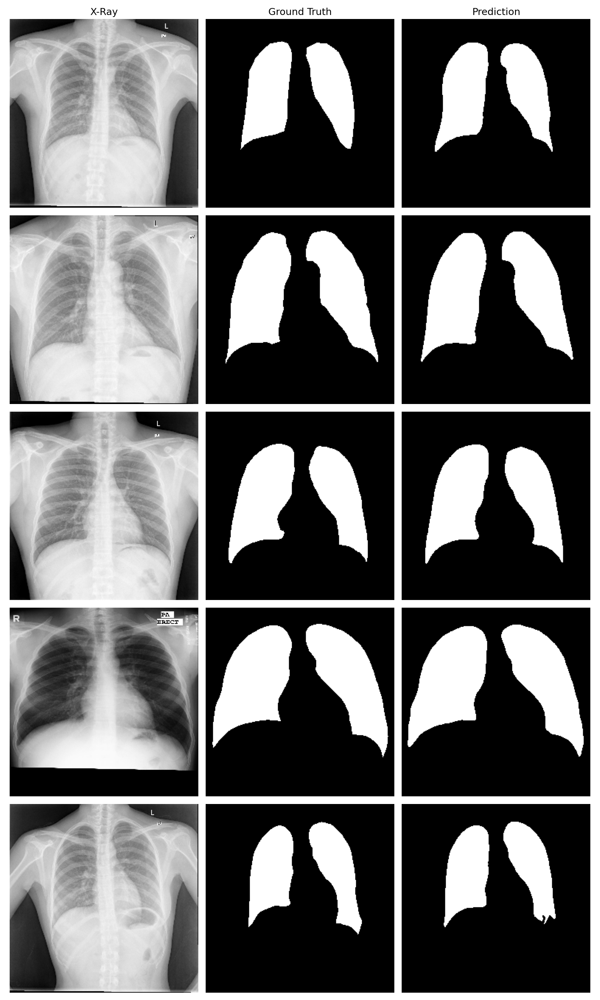

# 🫁 Chest X-Ray Lung Segmentation using U-Net

A deep learning pipeline for binary segmentation of lungs from chest X-rays, built from scratch using PyTorch and trained on the Montgomery + Shenzhen dataset. Achieves a **Dice Score of 0.9427** and **IoU of 0.8917** on the held-out test set.

---

## 📊 Results

| Metric | Score |
|---|---|
| Dice Score | **0.9427** |
| IoU (Jaccard) | **0.8917** |

### Sample Predictions



*Left: Original X-Ray | Center: Ground Truth Mask | Right: Model Prediction*

---

## 🏗️ Architecture — U-Net

The model follows the classic U-Net encoder-decoder architecture with skip connections, adapted for grayscale input and binary segmentation output.

```
Input (1, 256, 256)
         │
    DoubleConv ──────────────────────────────────────┐ skip1 (64, 256, 256)
         │ MaxPool
    DoubleConv ──────────────────────────────────┐ skip2 (128, 128, 128)
         │ MaxPool
    DoubleConv ──────────────────────────────┐ skip3 (256, 64, 64)
         │ MaxPool
    DoubleConv ──────────────────────────┐ skip4 (512, 32, 32)
         │ MaxPool
    Bottleneck                      (1024, 16, 16)
         │ ConvTranspose2d
   Concat(skip4) + DoubleConv       (512, 32, 32)
         │ ConvTranspose2d
   Concat(skip3) + DoubleConv       (256, 64, 64)
         │ ConvTranspose2d
   Concat(skip2) + DoubleConv       (128, 128, 128)
         │ ConvTranspose2d
   Concat(skip1) + DoubleConv       (64, 256, 256)
         │
   Conv2d(1x1) → Output (1, 256, 256)
```

**Model Stats:**
- Total Parameters: **31,042,369**
- Input: Grayscale X-Ray `(1, 256, 256)`
- Output: Binary Lung Mask `(1, 256, 256)`

---

## 📁 Project Structure

```
chest-xray-lung-segmentation/
├── Chest-X-Ray/               # Dataset (not tracked in git)
│   ├── image/                 # 704 chest X-rays
│   └── mask/                  # 704 lung segmentation masks
├── src/
│   ├── dataset.py             # Dataset class, augmentation, train/val/test split
│   ├── model.py               # U-Net architecture (DoubleConv, Encoder, Decoder, UNet)
│   ├── train.py               # Training loop with checkpointing
│   ├── evaluate.py            # Evaluation + visualization
│   └── metrics.py             # Dice Loss and IoU Score
├── notebooks/
│   ├── exploration.ipynb      # Dataset EDA
│   ├── dataset_dev.ipynb      # Dataset pipeline prototyping
│   ├── model_dev.ipynb        # Model architecture prototyping
│   └── train_dev.ipynb        # Training loop prototyping
├── scripts/
│   └── job.sh                 # SLURM job script for HPC training
├── outputs/
│   ├── checkpoints/           # Saved model weights (not tracked in git)
│   └── predictions/           # Visualization outputs
├── logs/                      # Training logs
├── environment.yml            # Conda environment
└── README.md
```

---

## 📦 Dataset

- **Source:** [Kaggle — Chest X-Ray Lungs Segmentation](https://www.kaggle.com/datasets/iamtapendu/chest-x-ray-lungs-segmentation)
- **Combined:** Montgomery County (USA) + Shenzhen Hospital (China) datasets
- **Size:** 704 chest X-rays with expert-annotated binary lung masks
- **Split:** 70% train / 15% val / 15% test (492 / 106 / 106)

---

## ⚙️ Setup

**Clone the repository:**
```bash
git clone https://github.com/atharvadhumal03/chest-xray-lung-segmentation
cd chest-xray-lung-segmentation
```

**Create conda environment:**
```bash
conda env create -f environment.yml
conda activate venv-lungseg
```

**Download the dataset** from [Kaggle](https://www.kaggle.com/datasets/iamtapendu/chest-x-ray-lungs-segmentation) and place it in `Chest-X-Ray/`.

---

## 🚀 Training

**Locally (Mac M3/MPS):**
```bash
python src/train.py
```

**On HPC (SLURM):**
```bash
sbatch scripts/job.sh
```

**With custom arguments:**
```bash
python src/train.py \
    --data_dir /path/to/Chest-X-Ray \
    --output_dir /path/to/outputs \
    --epochs 50 \
    --batch_size 16
```

---

## 📈 Evaluation

```bash
python src/evaluate.py
```

This will:
- Load the best saved model from `outputs/checkpoints/best_model.pth`
- Compute Dice Score and IoU on the test set
- Generate and save sample predictions to `outputs/predictions/`

---

## 🔧 Implementation Details

| Component | Details |
|---|---|
| Framework | PyTorch 2.6 |
| Architecture | U-Net (from scratch) |
| Loss Function | Dice Loss |
| Optimizer | Adam (lr=1e-4) |
| Batch Size | 16 |
| Epochs | 50 |
| Image Size | 256 × 256 |
| Augmentation | Horizontal flip, Affine transforms (Albumentations) |
| Training Hardware | NVIDIA Tesla V100 (Northeastern HPC) |

---

## 🧠 Key Learnings

- **Mixed image formats** — dataset contained `P`, `L`, and `RGB` mode images requiring `.convert('L')` normalization before training
- **Mask binarization** — masks had anti-aliased edges with continuous values; thresholding at 127 produced clean binary masks
- **Dice Loss over BCE** — Dice Loss handles class imbalance (background >> foreground pixels) more effectively for medical segmentation
- **Skip connections** — critical for recovering spatial detail lost during downsampling; directly contributed to sharp lung boundary predictions

---

## 📋 Requirements

See `environment.yml` for full dependencies. Key packages:
- `torch==2.6.0`
- `albumentations`
- `opencv-python`
- `scikit-learn`
- `matplotlib`
- `tqdm`